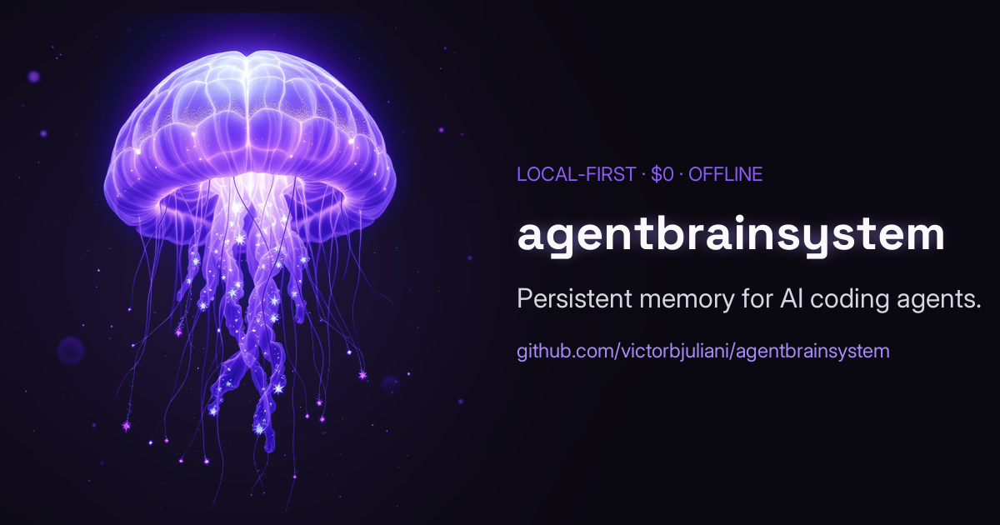

<h3>Your AI coding agent has amnesia. Cure it in one command.</h3>

<b>agentbrainsystem</b> is persistent memory for AI coding agents — it captures every coding
session and recalls what matters next time, so you stop re-explaining the same context every day.
<b>100% local, $0, offline.</b> Your code never leaves your machine.

---

## What it does

- 🧠 **Recall that actually works** — hybrid semantic + keyword search returns only what's relevant to the task in front of you. `~4 ms p95` on the per-prompt hot path.
- 🤫 **Set it once, forget it forever** — captures each session when it ends, feeds the right context back at the next start. One command, then it's invisible.
- 🔒 **Your code never leaves your laptop** — 100% local and offline. No cloud, no account, no API keys, no telemetry. `$0`.
- 🩹 **Verifiable, self-healing memory** — facts anchored to real code (`file:line@commit`), labeled ✓verified / ~claimed / ⚠stale, re-anchoring when code moves.
- 🗂️ **Project-scoped** — memory from one project never leaks into another.
- 🔌 **Works with five harnesses** — Claude Code, Codex CLI, Gemini CLI, GitHub Copilot CLI & OpenCode, all sharing one local memory store.
- 🕸️ **Visual memory graph** — explore the agent's memory as a living graph in your browser (`abs ui`).

## Get started

Full install, docs, and the source live in the main repository:

**→ https://github.com/victorbjuliani/agentbrainsystem**

The interactive site (this branch) lives at **https://victorbjuliani.github.io/agentbrainsystem/**.

---

**For maintainers** · This `gh-pages` branch *is* the static landing site (no build step) — edit
`index.html` / `styles.css` / `app.js` and push; GitHub Pages rebuilds in ~30–60 s. English is the
source of truth in `index.html`; `app.js` holds the PT-BR transcreation. Analytics: GoatCounter
(privacy-first, no cookies). Brand tokens follow `docs/DESIGN.md` on `main`.

MIT © 2026 Victor B. Juliani
